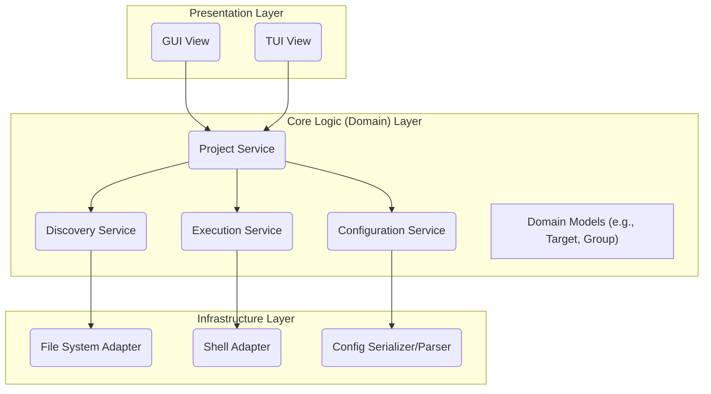

# High-Level Architecture and Design

**Version 1.0**

**Date:** 2026-01-02

---

## 1. Architectural Goals

- **Separation of Concerns:** The architecture shall enforce a strict separation between the user interface, the core application logic, and the platform-specific infrastructure.
- **Modularity & Testability:** Each component shall be independently testable. The Core Logic layer must be testable without any UI or live file system/shell interactions.
- **Flexibility:** The design must allow for the interchangeability of UI components (GUI vs. TUI) and adapt to different operating systems.

## 2. Architectural Pattern

A **Layered Architecture** (also known as N-Tier Architecture) is chosen for this project. This pattern aligns perfectly with the goal of separating concerns. The layers are arranged in a hierarchy, and communication generally flows downwards, with dependencies only pointing to the layer directly below.

The system will be composed of three primary layers:
1.  **Presentation Layer** (Top)
2.  **Core Logic (Domain) Layer** (Middle)
3.  **Infrastructure Layer** (Bottom)

## 3. Layered Architecture Diagram

## 4. Component Descriptions

### 4.1. Presentation Layer
- **Responsibility:** Handles all user interaction and displays data. This layer is "dumb" and contains no business logic.
- **Components:**
    - **GUI View:** The graphical user interface implementation. It will be built using a cross-platform GUI framework (e.g., Electron, Tauri, Qt). It communicates with the Core Logic layer to get data and trigger actions.
    - **TUI View:** The terminal user interface implementation. It will be built using a TUI framework (e.g., Textual, Bubble Tea). It communicates with the Core Logic layer in the same way the GUI does.

### 4.2. Core Logic (Domain) Layer
- **Responsibility:** Contains all the business logic and rules of the application. It is completely independent of the UI and the underlying platform. This is the heart of the system.
- **Components:**
    - **Project Service:** The main entry point for the Presentation Layer. It orchestrates the other services to fulfill use cases like "load project," "run target," etc.
    - **Discovery Service:** Responsible for scanning the file system (via the Infrastructure Layer) and parsing build artifacts to find potential targets.
    - **Execution Service:** Responsible for managing the execution of commands (via the Infrastructure Layer), including handling concurrency, cancellation, and state tracking.
    - **Configuration Service:** Manages the loading, saving, and modification of the project's dashboard configuration (`.project-dashboard.yml`).
    - **Domain Models:** Plain data structures that represent the core concepts of the application, such as `Target`, `Group`, and `Project`.

### 4.3. Infrastructure Layer
- **Responsibility:** Handles all communication with the outside world (file system, operating system shell, etc.). It implements interfaces defined by the Core Logic layer, isolating the core from platform-specific details.
- **Components:**
    - **File System Adapter:** Implements an interface for reading directories and files. This allows the Discovery Service to be tested with a mock file system.
    - **Shell Adapter:** Implements an interface for executing shell commands, capturing their output (`stdout`/`stderr`), and managing their lifecycle (e.g., cancellation). This allows the Execution Service to be tested without running real commands.
    - **Config Serializer/Parser:** Handles the serialization and deserialization of the configuration file (e.g., YAML, JSON).

## 5. Data Flow Example: Running a Target

1.  **User** clicks the "Run" button for a target in the **GUI View**.
2.  The **GUI View** calls the `runTarget(targetId)` method on the **Project Service**.
3.  The **Project Service** uses the **Execution Service** to initiate the task.
4.  The **Execution Service** gets the target's command from the **Configuration Service**.
5.  The **Execution Service** calls the `execute(command)` method on the **Shell Adapter**.
6.  The **Shell Adapter** creates a new process in the host OS shell.
7.  The **Shell Adapter** captures `stdout`/`stderr` and streams it back up to the **Execution Service**, which in turn notifies the **GUI View** to update the output pane.
